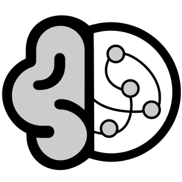
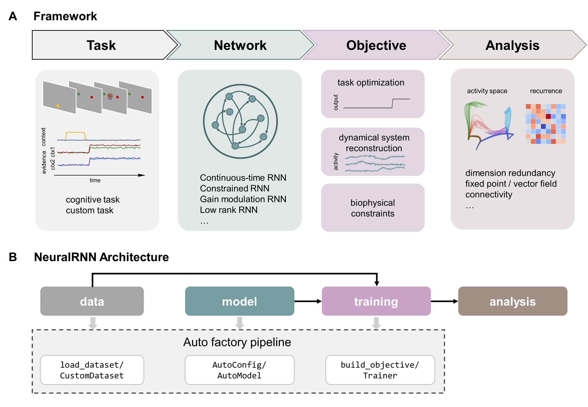

<h1>
  
  NeuralRNN
</h1>

---

**NeuralRNN [[Docs](https://neuralrnn.readthedocs.io/en/latest/)] is A unified framework for implementing RNN methods in cognitive neuroscience** — bringing two major paradigms under a single interface:

- **Paradigm A: Task Optimization**[^1]: Train RNNs on cognitive tasks, then reverse-engineer how they perform computation using analyses including fixed points, vector fields, dimensionality reduction, etc. The goal is to use RNNs as a proxy for cognitive computation.
- **Paradigm B: Dynamical System Reconstruction (DSR)**[^2][^3]: Fit generative RNNs directly from neural/behavioral time series that can reproduce attractors, power spectra, and Lyapunov spectra of the target system.

Both paradigms share a unified set of `model config`, `Trainer`, and `analysis` tools. **The only difference between the two paradigms is the `Objective`**: Paradigm A aims to optimize output for cognitive task performance, while Paradigm B aims to construct a dynamical system isomorphic to the target neural activity. Moreover, DSR can also be applied to reconstruct the dynamics of TBO-trained models for interpretability analysis[^4].


---

## Core Concept

All models are viewed as "discrete dynamical systems with downstream readout" $z_t=F_\theta(z_{t-1},x_t),\;y_t=G_\phi(z_t)$.

A model only needs to implement two methods:

```python
def recurrence(self, x_t, z_prev, *, inputs=None): ...  # single-step transition F
def readout(self, z_t): ...                              # readout G
```

NeuralRNN provides an interface to automatically connect the model to the unified trainer and all analysis tools.

## What NeuralRNN contains and not

NeuralRNN contains the pipeline to model RNN for neuroscience research, including (1) constructing dataset, (2) building and configuring RNN models, (3) training, and (4) model analysis (see the full pipeline in **[`custom pipeline`](notebook/03_custom_pipeline.ipynb)**  and the documents in **[`docs`](docs/README.md)**). We also provide the guide to implement each built-in model through this framework (see **[`notebook`](notebook/README.md)**).

However, there are others methods using dynamical system methods as well, including [MARBLE](https://www.nature.com/articles/s41592-024-02582-2), [FINDR](https://www.nature.com/articles/s41586-025-09528-4), [neuralflow](https://www.nature.com/articles/s41586-025-09199-1), and [SSMLearn](https://arxiv.org/abs/2510.13519). These model-agnostic methods aim to inference interpretable representations of neural population dynamics exactly from the neural response, which are not included in NeuralRNN but can be suitably combined for the further analysis of RNN models.


## Install

```bash
$ pip install neuralrnn
```

or

```bash
$ git clone https://github.com/ChenHH730/NeuralRNN.git
$ cd NeuralRNN
$ pip install -e .
```


## Quickstart

```python
from neuralrnn import AutoConfig, AutoModel, Trainer, TrainingArguments
from neuralrnn import TeacherForcingObjective, load_dataset

# 1) dataset
# use registered dataset or custom dataset
ds = load_dataset("lorenz63", sequence_length=200, batch_size=16, normalize=True) 

# 2) model (config) + objective (based on the paradigm) + training
cfg = AutoConfig.for_model("shallow_plrnn", input_dim=0, latent_dim=3,
        output_dim=3, hidden_dim=50, autonomous=True)  # model config
model = AutoModel.from_config(cfg)  # load model
Trainer(model, ds, TeacherForcingObjective(alpha=0.1),
        TrainingArguments(max_steps=2000)).train()  # train model

# 3) save and load (config.json + model.safetensors)
model.save_pretrained("ckpt/")
model = AutoModel.from_pretrained("ckpt/")

# 4) analysis (model agnostic)
from neuralrnn.analysis import find_fixed_points, max_lyapunov_exponent
fps = find_fixed_points(model)
```

## Content Structure

```
src/neuralrnn/
  configuration_utils.py   modeling_utils.py     # core contracts (Config / Model base classes)
  auto/                    # AutoConfig / AutoModel registration & dispatch
  models/                  # model zoo: ctrnn, ei_rnn, lowrank_rnn, plrnn, latent_circuit,
                           #   gated_rnn (GRU/LSTM + tiny_rnn), constrained_rnn, multiarea_rnn,
                           #   gain_rnn (gain_rnn + stp_rnn),
                           #   actor_critic (RL agent)
  train/                   # generic Trainer + paradigm Objectives + reusable loss terms /
                           #   regularizers / metrics + nested cross-validation
  rl/                      # RL layer: envs (ECHOICE, odor plume, neurogym/gym adapters,
                           #   SyncVectorEnv), recurrent rollout buffer, n-step/GAE returns,
                           #   PPO + REINFORCE losses (registry), RLTrainer, plume
                           #   agents/eval (rl.plume_agents / rl.plume_eval),
                           #   value-model probing (rl.probe);
                           #   critic-only TD = TDObjective + Trainer
  analysis/                # fixed points / linearization / vector fields / dim reduction /
                           #   Lyapunov / D_stsp, D_H / PLRNN invariant manifolds / sequentiality
notebook/                  # end-to-end tutorials for each paper
```

## Built-in Models

| Model | Paradigm | Status (mostly used) |
|---|---|---|
| continuous time RNN | A | ✅ |
| E-I RNN (Dale's principle) | A | ✅ |
| Latent Circuit Model | B | ✅ |
| piecewise linear RNN | B | ✅ |
| Tiny RNN | B | ✅ |
| low-rank RNN | AB | ✅ |
| constrained RNN | A | ✅ |
| seRNN | A | ✅ |
| multi-area RNN | A | ✅ |
| gain RNN | AB | ✅ |
| STP RNN | A | ✅ |
| actor-critic RNN (RL) | A | ✅ |
| value RNN (critic-only TD) | A | ✅ |

The second column shows the corresponding paradigm used in the original work.  

## Reinforcement Learning

The `rl` subpackage turns any registered RNN core into an RL agent and trains it
with on-policy algorithms, reusing the same `AutoConfig` / `AutoModel` /
`save_pretrained` machinery as the rest of the framework:

```python
from neuralrnn import (ActorCriticConfig, ActorCriticModel, RLTrainer,
                       RLTrainingArguments, SyncVectorEnv, make_env)

envs = SyncVectorEnv([make_env("echochoice", rules=(0,), seed=i) for i in range(32)])
agent = ActorCriticModel(ActorCriticConfig(
    core_config={"model_type": "ei_rnn", "input_dim": 16, "latent_dim": 256, ...},
    action_dim=4))
RLTrainer(agent, envs, RLTrainingArguments(output_dir="ckpt/")).train()
```

See `docs/RL_PLAN.md` for the design and
[`notebook/18_rl_rnn_paradigmA.ipynb`](notebook/18_rl_rnn_paradigmA.ipynb) for a
full reproduction (reduced config) of the E-I actor-critic RNN of Battista et
al. (2026) on the ECHOICE economic-choice battery. Continuous-action agents
(diagonal Gaussian heads over any core) are supported too — see
[`notebook/s1_plumetracknets.ipynb`](notebook/s1_plumetracknets.ipynb) for a
reproduction of the PPO-trained plume-tracking RNN of Singh et al. (2023),
including the replayed-turbulence env (`make_env("plume")`), the fixed-grid
evaluation assay (`rl.plume_eval`) and the paper's behavior/neural analyses
(notebook-local plume utils): behavioral regimes, centerline-vs-wind course
direction on
the non-stationary wind datasets, odor-memory window scans, common-subspace /
limit-cycle dynamics, eigenspectrum reorganization and transition-time
asymmetry. New algorithms plug in via
`register_rl_loss` (built-ins: `PPOLoss`, `ReinforceLoss`); new environments
via `register_env` (built-ins:
`echochoice`, `plume`, `maze`, `neurogym:<Task>`, `gym:<id>`). For a guided tour of
the RL layer, see
[`notebook/reinforcement_learning.ipynb`](notebook/reinforcement_learning.ipynb)
(REINFORCE + value baseline on neurogym PDM, after Song, Yang & Wang 2017).
Model-based planning on top of a learned world model is supported through the
agent's auxiliary prediction head plus `rl.planning.WorldModelPlanner`
(imagined rollouts fed back as observation channels) — see
[`notebook/s2_metalearning.ipynb`](notebook/s2_metalearning.ipynb) for a
reproduction of the maze meta-learning / replay agent of Jensen, Hennequin &
Mattar (2024), trained with `A2CPredLoss` (REINFORCE + value + entropy +
world-model cross-entropy) on `make_env("maze")`.

Critic-only value learning (no policy) is covered without the RL trainer:
`TDObjective` + the generic `Trainer` turn any RNN core with a scalar readout
into a value-RNN; `ContingencyDataset` (Pavlovian contingency experiments) and
`neuralrnn.rl.probe` / `analysis.cca` (multi-view state-space alignment)
support the analyses. See
[`notebook/19_value_rnn_paradigmA.ipynb`](notebook/19_value_rnn_paradigmA.ipynb)
for a reproduction (reduced config) of Fig. 6 of Qian & Burrell (2024).

## Porting New Papers into the Framework

Core principle: **Porting = writing adapters (wrapping + verification), not rewriting mathematics**. Any model that implements `recurrence/readout` is plug-and-play; the analysis layer works only through the model's public contract and never imports specific model classes.

## License

MIT, see [LICENSE](LICENSE). Original code of ported papers belongs to their respective authors; please follow their individual licenses when porting.

## References

[^1]: [Training Excitatory-Inhibitory Recurrent Neural Networks for Cognitive Tasks](https://doi.org/10.1371/journal.pcbi.1004792). 

[^2]: [Reconstructing computational dynamics from neural measurements with RNN](https://www.nature.com/articles/s41583-023-00740-7)

[^3]: [Discovering cognitive strategies with tiny-RNN](https://www.nature.com/articles/s41586-025-09142-4) 

[^4]: https://github.com/engellab/latentcircuit

[^5]: https://github.com/Dynamics-of-Neural-Systems-Lab/MARBLE
